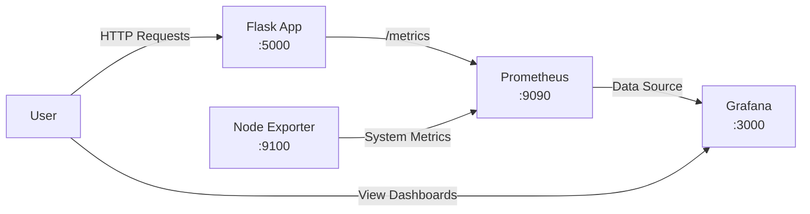

# GrafanaDemo

A monitoring stack demonstration using Flask, Prometheus, and Grafana to showcase metrics collection and visualization.

## Overview

This project demonstrates a complete monitoring solution with:
- **Flask App**: Simple web application with Prometheus metrics endpoint
- **Prometheus**: Time-series database for metrics collection
- **Grafana**: Visualization and dashboarding platform
- **Node Exporter**: System metrics collector

## Architecture



## Project Structure

```
GrafanaDemo/
│
├── flask-app/
│   ├── app.py              # Flask application with metrics endpoint
│   ├── requirements.txt    # Python dependencies
│   └── Dockerfile         # Container image for Flask app
│
├── docker-compose.yml     # Multi-container orchestration
├── prometheus.yml         # Prometheus configuration
└── README.md             # This file
```

## Quick Start

1. **Clone the repository**
   ```bash
   git clone https://github.com/AdirGelkop/GrafanaDemo
   cd GrafanaDemo
   ```

2. **Start the monitoring stack**
   ```bash
   docker-compose up -d
   ```

3. **Access the services**
   - Flask App: http://localhost:5000
   - Prometheus: http://localhost:9090
   - Grafana: http://localhost:3000 (default login: admin/admin)

## Components

### Flask Application
- Simple "Hello, World!" endpoint at `/`
- Prometheus metrics exposed at `/metrics`
- Tracks total request count with `total_requests` counter

### Prometheus Configuration
- Scrapes Flask app metrics every 5 seconds
- Collects system metrics from Node Exporter
- Stores time-series data for Grafana queries

### Available Metrics
- `total_requests`: Number of requests to Flask root endpoint
- System metrics: CPU, memory, disk, network (via Node Exporter)

## Setting Up Grafana

1. Login to Grafana (http://localhost:3000)
2. Add Prometheus as a data source:
   - URL: `http://prometheus:9090`
3. Import dashboards or create custom ones
4. Recommended dashboards:
   - Node Exporter Full (ID: 1860)
   - Custom Flask metrics dashboard

## Testing the Setup

1. Generate traffic to Flask app:
   ```bash
   for i in {1..100}; do curl http://localhost:5000; done
   ```

2. Check metrics in Prometheus:
   - Navigate to http://localhost:9090
   - Query: `total_requests`

3. View in Grafana:
   - Create a panel with the `total_requests` metric
   - Observe real-time updates

## Stopping the Stack

```bash
docker-compose down
```

To remove volumes:
```bash
docker-compose down -v
```

## Requirements

- Docker
- Docker Compose

